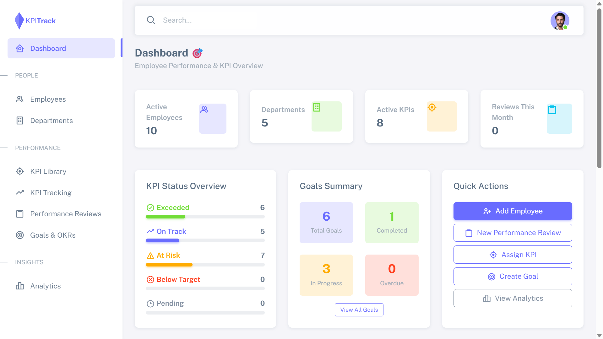
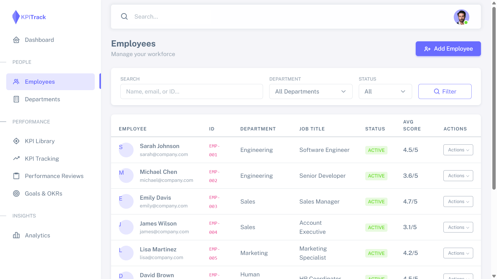
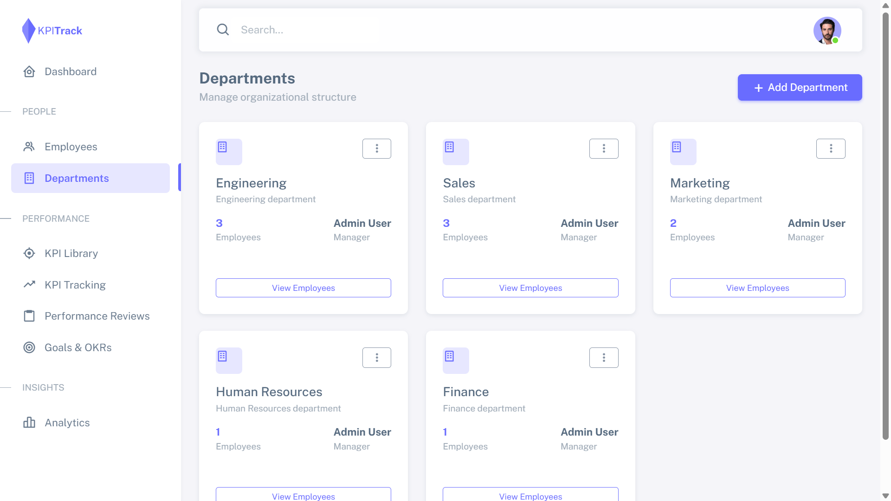
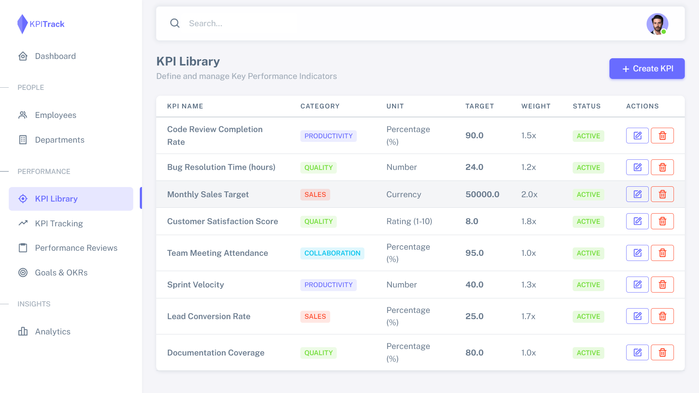
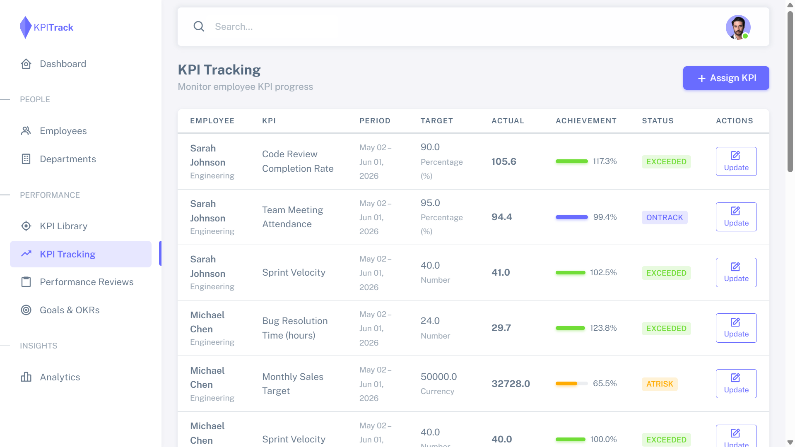
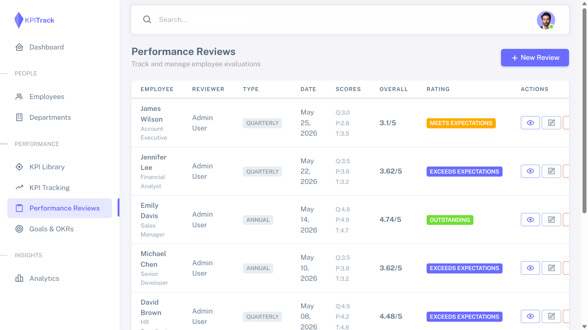
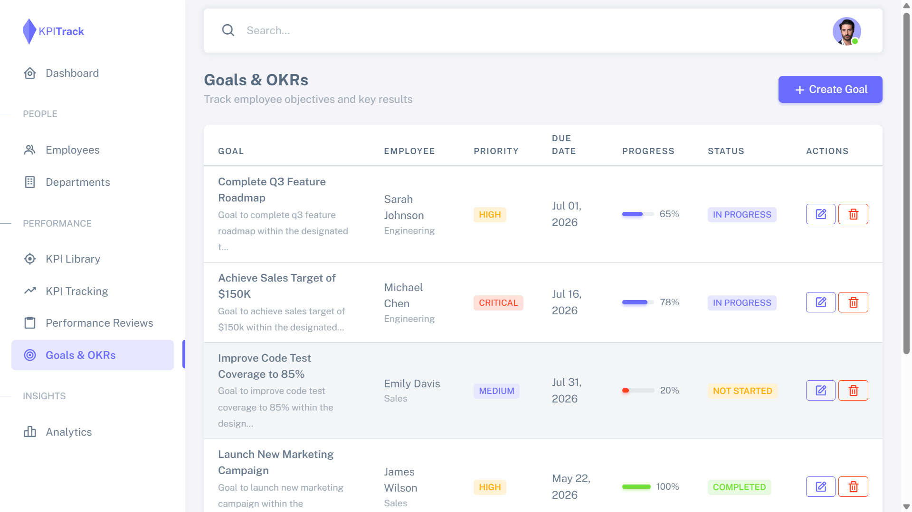
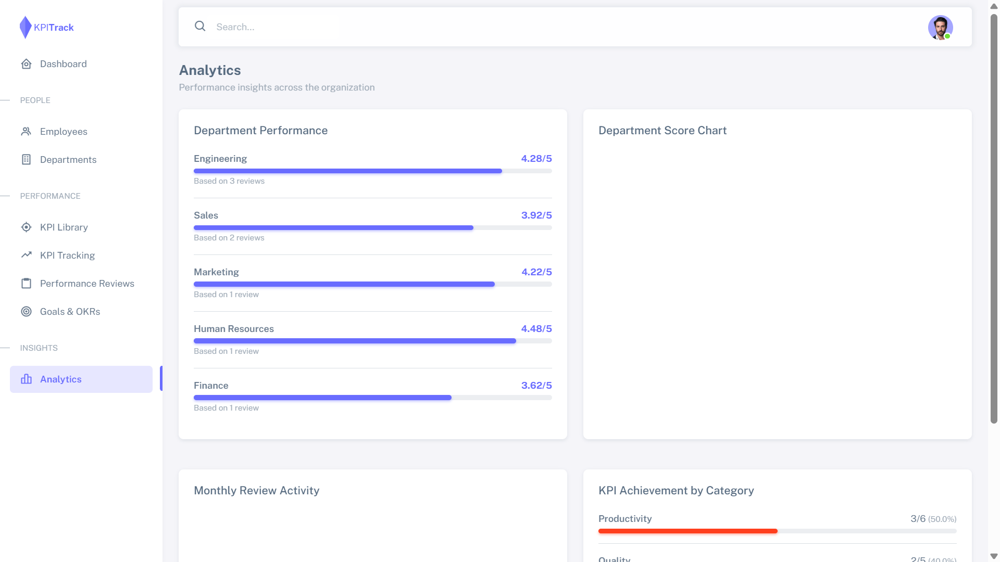

# KPI Management System

A comprehensive Employee KPI Tracking and Performance Management System built with Django. The application enables organizations to manage employees, departments, KPIs, goals, and performance reviews while providing analytics and insights into workforce performance.

## Features

### Employee Management

* Employee profiles and information management
* Employee performance tracking
* Department assignment and organization

### Department Management

* Create and manage departments
* Department-wise employee organization
* Department performance overview

### KPI Library

* Centralized KPI repository
* Define and manage KPI metrics
* Reusable KPI templates

### KPI Tracking

* Track employee KPI progress
* Monitor KPI achievements
* Performance measurement and evaluation

### Performance Reviews

* Conduct employee performance reviews
* Review history and records
* Performance assessment workflows

### Goals Management

* Set employee goals and objectives
* Track goal completion status
* Align goals with organizational KPIs

### Analytics Dashboard

* Performance analytics and reporting
* KPI achievement insights
* Employee and department performance trends

## Technology Stack

* Python
* Django
* SQLite
* HTML5
* CSS3
* Bootstrap
* JavaScript

---

## Installation

### 1. Extract the project

```bash
unzip kpi_management_system.zip
```

### 2. Navigate to the project directory

```bash
cd kpi_system
```

### 3. Install Django

```bash
pip install django
```

### 4. Apply database migrations

```bash
python manage.py migrate
```

### 5. Load sample data

```bash
python manage.py seed_data
```

This command loads sample:

* Employees
* Departments
* KPIs
* Performance Reviews
* Goals

### 6. Run the development server

```bash
python manage.py runserver
```

### 7. Open in your browser

```text
http://127.0.0.1:8000/
```

---

## Screenshots

### Dashboard



### Employee Management



### Department Management



### KPI Library



### KPI Tracking



### Performance Reviews



### Goals Management



### Analytics



---

## Sample Data

The project includes a custom data seeding command:

```bash
python manage.py seed_data
```

This generates realistic sample data for testing and demonstration purposes.

---

## Project Structure

```text
kpi_system/
│
├── employees/
├── departments/
├── kpis/
├── reviews/
├── goals/
├── analytics/
│
├── templates/
├── static/
├── screenshots/
│
├── manage.py
└── requirements.txt
```

---

## Key Functionalities

* Employee KPI monitoring
* Department performance management
* Goal setting and tracking
* KPI library management
* Performance review workflows
* Data-driven analytics
* Administrative dashboard

---

## Future Enhancements

* Role-based access control
* Email notifications
* KPI approval workflows
* PDF performance reports
* REST API integration
* Data export (Excel/PDF)
* Interactive charts and dashboards

---

## Author

**Adnan**

Software Developer | Django Developer

Built as a portfolio project to demonstrate Django development, database modeling, CRUD operations, analytics dashboards, and business process automation.
